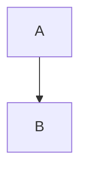

# @showwaiyan/rendermd Usage Examples

## Installation

```bash
# Global installation (recommended)
npm install -g @showwaiyan/rendermd

# Or use npx without installation
npx @showwaiyan/rendermd README.md
```

## Basic Examples

### 1. Render a Simple Markdown File

```bash
rendermd README.md
```

Output:
```
Rendering: README.md
Generated: /tmp/rendermd-a1b2c3d4.html
Opened in browser
Temp file will be cleaned up in 60s
```

### 2. Force Dark Theme

```bash
rendermd documentation.md --theme dark
```

### 3. Force Light Theme

```bash
rendermd notes.md --theme light
```

### 4. Disable Table of Contents

```bash
rendermd article.md --no-toc
```

Useful for simple documents without headings.

### 5. Keep the HTML File

```bash
rendermd report.md --no-auto-cleanup
```

The temp file path will be printed so you can save it.

### 6. Custom Cleanup Delay (5 minutes)

```bash
rendermd presentation.md --cleanup-delay 300000
```

### 7. Minimal Rendering (No Extra Features)

```bash
rendermd basic.md --no-toc --no-copy-button --no-math --no-mermaid
```

## Configuration File Examples

### Example 1: Developer Setup

`.rendermdrc.json` in your project:

```json
{
  "theme": "dark",
  "toc": true,
  "copyButton": true,
  "syntaxHighlight": true,
  "math": true,
  "mermaid": true,
  "autoCleanup": false
}
```

### Example 2: Documentation Writer

```json
{
  "theme": "light",
  "toc": true,
  "copyButton": true,
  "syntaxHighlight": true,
  "math": false,
  "mermaid": false,
  "autoCleanup": true,
  "cleanupDelay": 120000
}
```

### Example 3: Math-Heavy Content

```json
{
  "theme": "auto",
  "toc": true,
  "math": true,
  "mermaid": false,
  "copyButton": false
}
```

## Advanced Usage

### Working with Different File Types

```bash
# Technical documentation
rendermd API.md --theme dark --toc

# Blog post
rendermd blog-post.md --no-toc

# Math notes
rendermd calculus.md --math

# Diagrams and flowcharts
rendermd architecture.md --mermaid
```

### Integration with Other Tools

#### With Git Hooks

```bash
# In .git/hooks/pre-commit
#!/bin/bash
rendermd CHANGELOG.md --no-auto-cleanup
```

#### With npm scripts

In `package.json`:

```json
{
  "scripts": {
    "preview": "rendermd README.md",
    "docs": "rendermd docs/API.md --theme dark"
  }
}
```

Then run:

```bash
npm run preview
npm run docs
```

#### With Make

In `Makefile`:

```makefile
preview:
	rendermd README.md

docs:
	rendermd docs/*.md --no-auto-cleanup
```

## Markdown Examples That Work Great

### Code Blocks

````markdown
```javascript
const greeting = "Hello, World!";
console.log(greeting);
```
````

### Math Equations

```markdown
Inline: $E = mc^2$

Block:
$$
\frac{-b \pm \sqrt{b^2 - 4ac}}{2a}
$$
```

### Mermaid Diagrams

````markdown

````

### Tables

```markdown
| Feature | Supported |
|---------|-----------|
| GFM | ✅ |
| Math | ✅ |
| Diagrams | ✅ |
```

### Task Lists

```markdown
- [x] Completed task
- [ ] Pending task
```

## Troubleshooting

### File Not Found

```bash
rendermd non-existent.md
# Error: File not found: /path/to/non-existent.md
```

Solution: Check file path and spelling.

### Browser Doesn't Open

The tool uses your system's default browser. If it doesn't open:

1. Check that you have a default browser set
2. Try the `--no-auto-cleanup` flag and open the temp file manually

### Math Not Rendering

Make sure your math is properly formatted:

```markdown
✅ Correct: $x = 5$
❌ Incorrect: $ x = 5 $ (extra spaces)
```

### Mermaid Diagram Not Showing

Ensure your diagram code is valid:

````markdown

````

Note: `mermaid` must be lowercase in the code fence.

## Tips & Tricks

### 1. Create an Alias

Add to your `.bashrc` or `.zshrc`:

```bash
alias md='rendermd'
```

Then use:

```bash
md README.md
```

### 2. Preview Before Committing

```bash
git diff HEAD README.md > changes.diff
rendermd changes.diff
```

### 3. Quick Notes Workflow

```bash
# Create a note
echo "# Quick Note\n\nSome thoughts..." > note.md

# Preview it
rendermd note.md
```

### 4. Compare Themes

```bash
# Light theme
rendermd doc.md --theme light

# Dark theme  
rendermd doc.md --theme dark
```

### 5. Batch Processing

```bash
# Preview all markdown files (be careful with cleanup!)
for file in *.md; do
    rendermd "$file" --cleanup-delay 10000
    sleep 2
done
```

## Common Workflows

### Documentation Review

```bash
rendermd README.md --no-auto-cleanup
# Review in browser
# Make edits
rendermd README.md --no-auto-cleanup
# Review again
```

### Blog Post Writing

```bash
rendermd draft.md --theme light --no-toc
```

### Technical Specification

```bash
rendermd spec.md --theme dark --math --mermaid
```

### Meeting Notes

```bash
rendermd notes-2026-01-14.md --no-auto-cleanup
```

## Getting Help

```bash
# Show all options
rendermd --help

# Show version
rendermd --version
```

## Feedback & Issues

Found a bug or have a feature request? Open an issue at:
https://github.com/Showwaiyan/Render-md/issues
